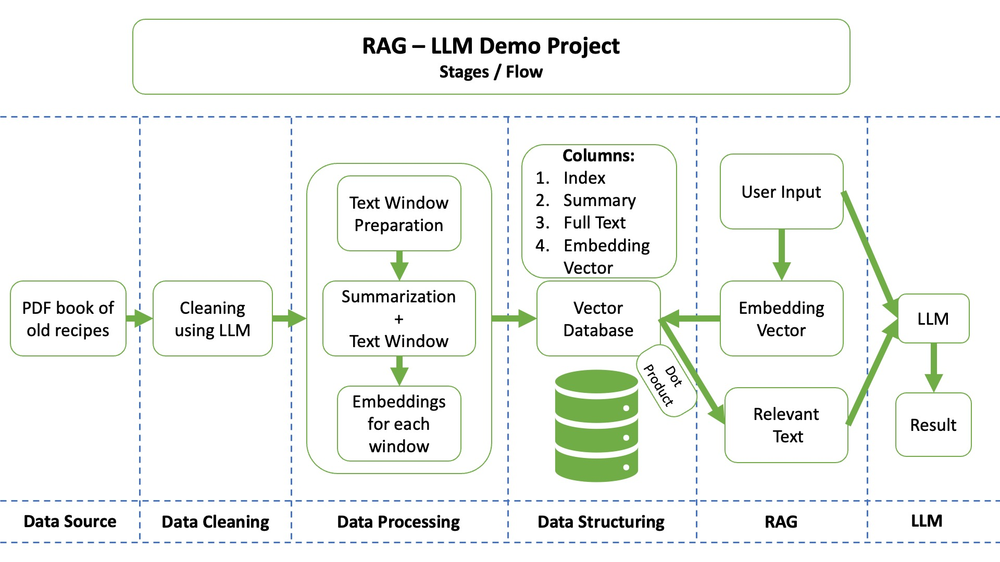

# Old Recipes Finder: RAG-LLM Demo Project

Welcome to the Old Recipes Finder, an application that brings the culinary wisdom of the past into the present through an interactive and user-friendly interface. This RAG-LLM Demo Project utilizes machine learning to process and retrieve historical recipes from a PDF book of old recipes from the Chicago Women's Club of 1887.

## Application Overview

The Old Recipes Finder application employs a multi-stage process involving data cleaning, processing, structuring, and retrieval augmented by language models (LLM) to deliver precise recipe information to users. The system relies on a vector database of recipe embeddings to match user queries with the most relevant historical recipes.

## How It Works

1. **Data Source:** It starts with a PDF book of historical recipes.
2. **Data Cleaning:** The content is standardized using LLM.
3. **Data Processing:** The clean data is prepared and summarized into manageable text windows, with embeddings generated for machine readability.
4. **Data Structuring:** Embeddings are stored in a JSON-formatted vector database.
5. **RAG Stage:** User queries are transformed into embeddings and matched with the database.
6. **LLM Stage:** The matched content is processed by an LLM to provide the final recipe output.

## Setup Instructions

Before running the application, ensure you have the following prerequisites installed:

- Python 3.9+
- Flask
- Pandas
- NumPy
- Access to RAG and LLM APIs (Gemini by Google)
